# Reference Analysis

**분석일:** 2026-09-19
**분석 대상:** 14장 스크린샷 (6개 앱: 홀릭스 · 크몽 · 클래스101 · 프립 · 말해보카 · 차란)
**대상 PRD:** PRD.md (§5 시연 화면 5개 · §9 브랜드 방향 · §10 참고 앱)

---

## 종합 요약

이번 분석에서 추출한 핵심:

- 반복되는 UX 패턴 5개
- 공통 시각 스타일 5개
- 재사용 컴포넌트 6개

핵심 통찰:

- 등록/설정류 플로우(홀릭스 계좌등록, 차란 판매등록)는 공통적으로 "선택형 그리드 → 하단 sticky CTA"로 마무리된다. 내 자산 등록·미션 제출에 그대로 적용 가능.
- 상세 페이지(PDP)는 크몽·프립·차란 모두 "이미지 위 뱃지/태그 오버레이 + 하단 sticky 액션 바(찜·문의·구매)" 구조를 공유한다. 허들링 픽 상세와 미션 제출 화면에 적용.
- 말해보카의 진행률+잠금 트로피 카드가 PRD 홈의 "이번 달 미션 카드(진행률, D-day)"와 구조적으로 가장 가깝다. 색은 브랜드 보라가 아니라 우리 톤(따뜻함)으로 재해석 필요.

---

## UX 패턴

### 1. 단계형 등록 플로우 (그리드 선택 → 하단 확정)

- **근거 앱:** 홀릭스 (001, 002, 003), 차란 (013)
- **관찰:** 홀릭스는 "홀릭스페이 관리" 화면에서 primary 버튼(카드 및 계좌 설정)을 탭하면 계좌등록/카드등록 탭 토글이 있는 화면으로 전환되고, 그 아래 은행 아이콘 3열 그리드에서 하나를 선택하는 구조(003). 차란은 사진 등록 시 촬영/최근항목 그리드에서 여러 장을 고르면 하단에 "N 선택 완료하기" sticky 버튼이 나타난다(013).
- **우리 앱 적용:** 내 자산 화면의 "새 자산 등록" — 파일 첨부를 그리드 선택형으로 만들고 하단에 "N개 선택 완료" sticky 버튼. 미션 상세의 "제출하기(파일 첨부)"에도 동일 패턴 적용.
- **참고 이미지:**
  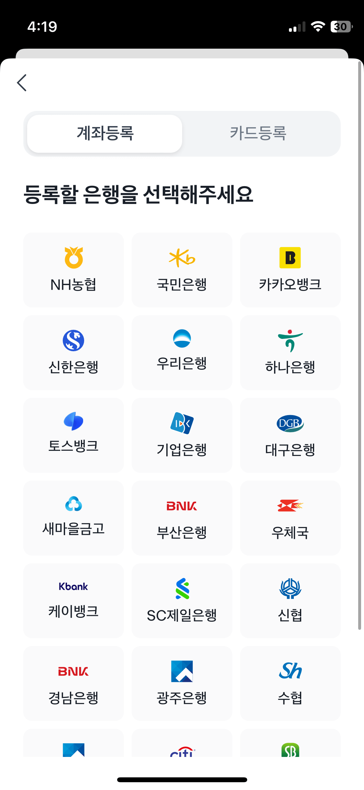
  

### 2. Sticky 하단 액션 바 (2~3버튼)

- **근거 앱:** 크몽 (004), 프립 (009), 말해보카 (011), 차란 (013)
- **관찰:** 크몽 PDP는 하단에 찜(아이콘)·문의하기(보더 버튼)·구매하기(진한 버튼) 3버튼 바가 화면 최하단에 고정. 프립 PDP도 찜·메시지·참여하기(보라 진한 버튼) 3버튼 구조. 말해보카는 모달 안에서 취소(회색)/바로 학습(보라, primary) 2버튼. 차란은 선택 완료 1버튼 풀와이드.
- **우리 앱 적용:** 미션 상세의 "제출하기", 허들링 픽 상세의 "구매하기"에 하단 고정 액션 바 적용. 보조 액션(찜/문의)은 아이콘 버튼으로 좌측에, primary는 우측 넓은 버튼으로.
- **참고 이미지:**
  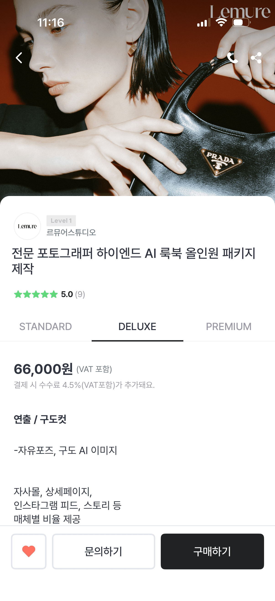
  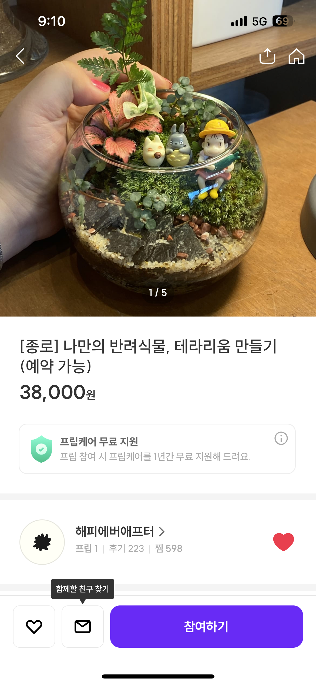

### 3. 게이미피케이션 진행률 + 잠금 카드

- **근거 앱:** 말해보카 (010)
- **관찰:** 상단 일러스트 히어로(캐릭터+말풍선+다이아 재화 카운터) 아래, Lv 뱃지가 붙은 카드 리스트가 이어진다. 각 카드는 잠긴 트로피 아이콘(회색 자물쇠) + 보상 재화 수 + 진행바(1/3) + 제목으로 구성. 잠금 여부가 회색톤으로 명확히 구분된다.
- **우리 앱 적용:** 홈 화면 "이번 달 미션 카드(진행률, D-day)" — 진행바 + 마감 D-day 뱃지 + 잠금/진행중/완료 상태를 색으로 구분. 단, 캐릭터 일러스트·재화 아이콘 같은 게임 요소는 PRD 톤("따뜻하고 실험적")에 맞게 배제하거나 최소화.
- **참고 이미지:**
  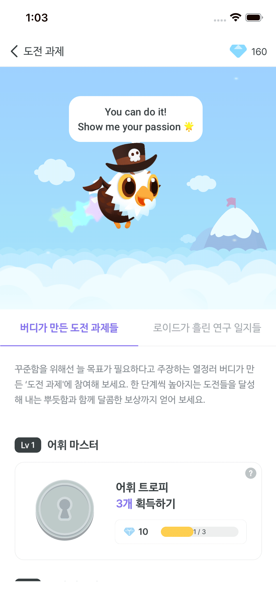

### 4. 마이페이지 그룹 리스트 메뉴

- **근거 앱:** 크몽 (005), 차란 (012)
- **관찰:** 둘 다 상단 프로필 행(아바타+이름+편집 버튼) → 잔여 포인트/크레딧을 보여주는 박스(강조 배경, CTA 버튼 포함) → "구매"/"판매" 같은 섹션 제목 아래 chevron이 붙은 리스트 행들이 이어지는 구조. 크몽은 배너형 CTA("전문가 등록하고 수익 창출")를 리스트 중간에 삽입.
- **우리 앱 적용:** 내 자산 화면의 "판매 수익 요약"을 상단 강조 박스로, 자산 목록 필터(전체/비공개/멤버공개/판매신청중/판매중)를 그 아래 섹션형 리스트로 구성.
- **참고 이미지:**
  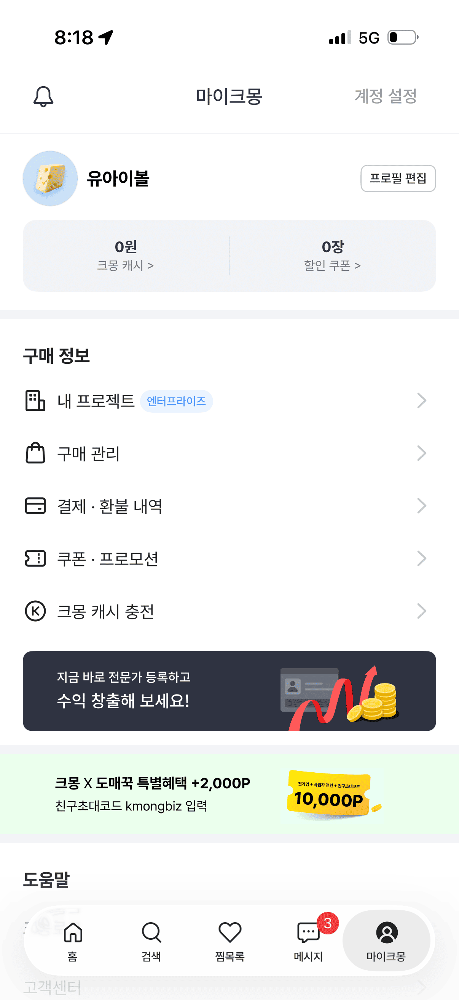
  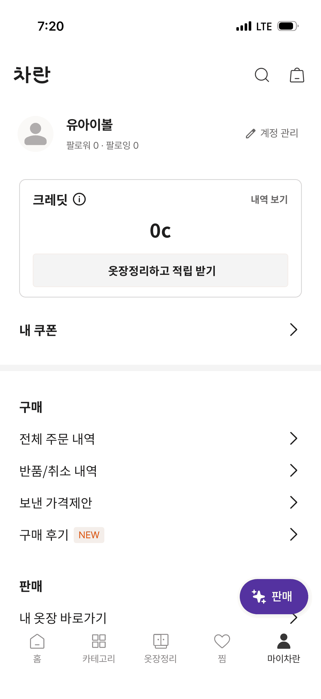

### 5. 빈 상태 안내 (일러스트 + 안내 문구)

- **근거 앱:** 홀릭스 (001)
- **관찰:** 리스트가 비어 있을 때 화면 중앙에 옅은 강조색 문서 아이콘 + "결제하신 내역이 없습니다." 회색 텍스트만 놓이고 다른 장식은 없음.
- **우리 앱 적용:** 내 자산 필터 결과가 0건일 때, 미션 제출 이력이 없을 때 동일한 최소 구성(아이콘+한 줄 안내)의 빈 상태 적용.
- **참고 이미지:**
  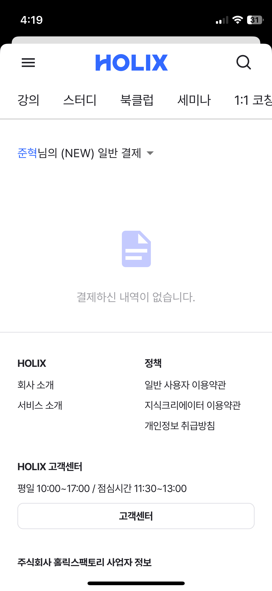

**패턴 부족 표시:** 없음 (5개 확보, 최소 요구 3개 충족)

---

## 시각 패턴

### 1. 이미지 위 뱃지/태그 오버레이

- **근거 앱:** 차란 (014), 프립 (008)
- **관찰:** 차란 PDP는 이미지 좌상단에 짙은 회색 "품절" 뱃지, 우상단에 "AI 제작 이미지" 라벨 태그, 좌하단에 "Excellent" 품질 뱃지를 이미지 위에 직접 얹는다. 프립 카테고리 그리드는 이미지 카드 좌하단에 흰 텍스트 라벨, 일부 카드 우상단에 "전국 기준" 작은 배지를 겹친다.
- **우리 앱 적용:** 내 자산 카드의 상태 뱃지(비공개/멤버공개/판매신청중/판매중)를 썸네일 이미지 좌상단 오버레이로, 스킬 카드의 무료/유료 표시를 이미지 우상단 오버레이로.
- **참고 이미지:**
  
  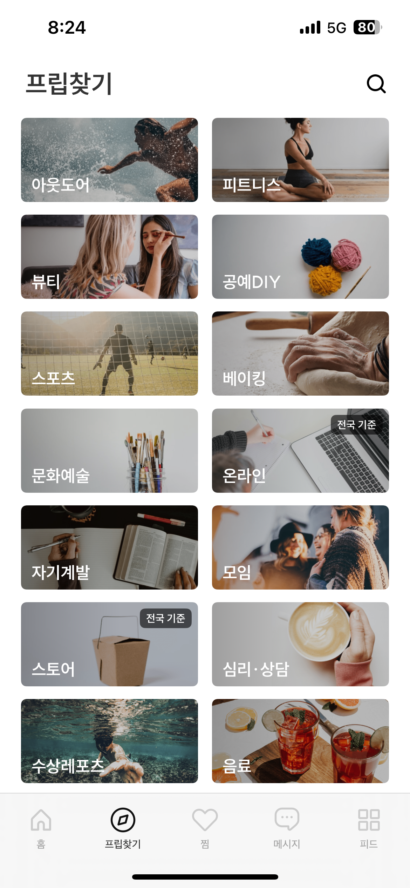

### 2. 화이트 배경 + 단일 강조색 CTA

- **근거 앱:** 홀릭스 (002 — 파랑), 말해보카 (011 — 보라), 차란 (012, 013 — 보라)
- **관찰:** 세 앱 모두 배경은 흰색이고 텍스트는 검정/회색 위계이며, primary 버튼과 선택된 탭 밑줄에만 브랜드 강조색(홀릭스 파랑, 말해보카·차란 보라)을 쓴다. 나머지 UI는 무채색.
- **우리 앱 적용:** design-rules 토큰에서 semantic 색은 배경(흰색)·텍스트(그레이스케일 위계)·강조색(primary CTA·선택 상태) 3그룹으로만 한정. PRD §9 "신뢰감+젊음" 컬러 힌트에 맞춰 강조색 1개를 확정.
- **참고 이미지:**
  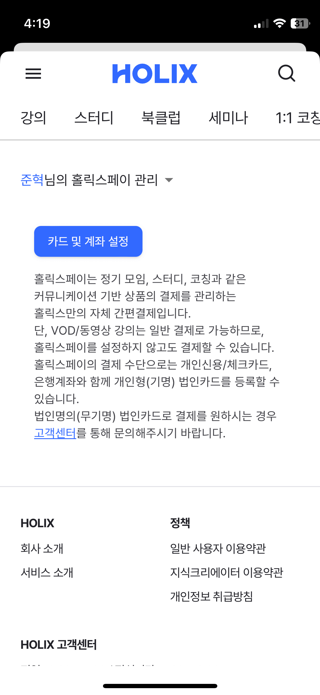
  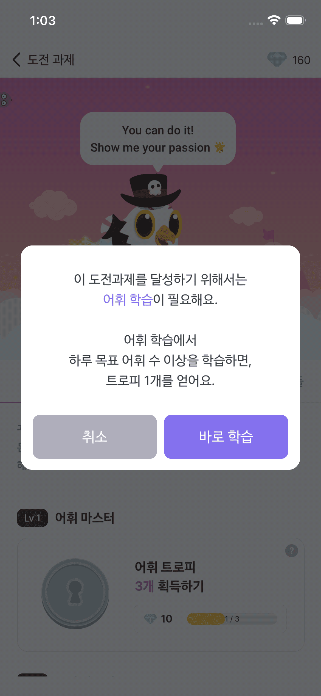

### 3. 2열 카드형 그리드

- **근거 앱:** 프립 (008)
- **관찰:** 카테고리 14개를 2열 x 7행 이미지 카드로 배치, 카드 간 간격이 일정하고 카드 하단에 좌측 정렬 텍스트 라벨이 이미지와 겹쳐 배치된다. 스크롤 밀도는 높은 편(한 화면에 카드 3.5개 노출).
- **우리 앱 적용:** 스킬 라이브러리의 카테고리 필터를 그리드보다는 칩(가로 스크롤)으로 쓰되, 스킬 카드 자체의 그리드 배치(2열)는 이 패턴을 참고.
- **참고 이미지:**
  

### 4. 리스트 항목 밀도 (아이콘 + 텍스트 + chevron)

- **근거 앱:** 크몽 (005), 차란 (012)
- **관찰:** 각 리스트 행은 좌측 라인 아이콘 + 텍스트 레이블 + 우측 화살표(>)로 구성되고 행 높이는 넉넉한 편(터치 영역 확보), 구분선 없이 여백으로만 행을 나눈다.
- **우리 앱 적용:** 내 자산 화면의 부가 메뉴(판매 수익 요약 하단 링크 등)에 적용 가능. 단, PRD 시연 범위에는 설정/프로필이 없으므로 내 자산 화면 내 보조 링크 수준으로 제한.
- **참고 이미지:**
  

### 5. 순위/숫자 강조 컬러 포인트

- **근거 앱:** 클래스101 (006)
- **관찰:** 인기 검색어 리스트에서 순번 숫자(1~10)만 주황색으로 강조하고 텍스트는 검정. 다른 장식 없이 숫자 색상만으로 랭킹감을 준다.
- **우리 앱 적용:** 스킬 라이브러리에 "이번 주 인기 스킬" 같은 섹션이 생기면 순번 숫자 강조 방식을 재사용. PRD 시연 범위 화면 5개에는 직접 대응 화면 없음 — 참고용으로만 기록.
- **참고 이미지:**
  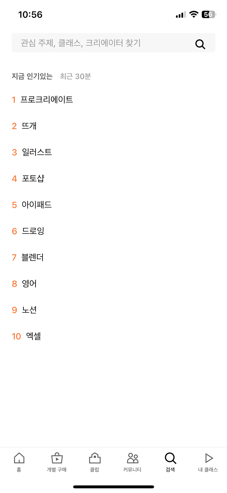

---

## 컴포넌트 패턴

### 1. 하단 탭바 (5개 아이템)

- **근거 앱:** 크몽 (005 — 홈/검색/찜목록/메시지/마이크몽), 프립 (008 — 홈/프립찾기/찜/메시지/피드), 차란 (012 — 홈/카테고리/옷장정리/찜/마이차란)
- **관찰:** 세 앱 모두 아이콘+라벨 5개 구성이며, 현재 탭만 채워진 아이콘(또는 진한 색)으로 강조. 크몽은 메시지 탭에 빨간 숫자 배지(3)를 얹는다.
- **우리 앱 적용:** 홈/스킬 라이브러리/미션/내 자산/허들링 픽 5개를 하단 탭바로 구성 (PRD §4 정보구조와 정확히 5개로 일치).
- **참고 이미지:**
  

### 2. 플로팅 액션 버튼 (Pill 형태)

- **근거 앱:** 차란 (012)
- **관찰:** 탭바 위, 화면 우측 하단에 별 아이콘 + "판매" 텍스트가 든 보라색 pill 버튼이 다른 콘텐츠 위에 떠 있는 형태로 고정.
- **우리 앱 적용:** 내 자산 화면의 "새 자산 등록" primary 액션을 리스트 최상단 버튼 대신 플로팅 pill 버튼으로 배치하는 대안으로 고려 (PRD는 "새 자산 등록 버튼"만 명시, 위치는 미지정).
- **참고 이미지:**
  

### 3. 상태 뱃지 (이미지 오버레이형)

- **근거 앱:** 차란 (014)
- **관찰:** "품절" 뱃지는 짙은 회색 배경에 흰 텍스트, 모서리가 둥근 사각형으로 이미지 좌상단에 고정. 배송정보 영역의 구매 버튼도 품절 상태에서는 텍스트만 남기고 회색으로 비활성화된다.
- **우리 앱 적용:** Asset 데이터 모델의 `visibility`(private/member_only/sale_requested/for_sale)와 `review_status`를 이 방식의 상태 뱃지로 시각화. 판매완료/검수중 상태는 톤을 낮춘 비활성 스타일로.
- **참고 이미지:**
  

### 4. 세그먼트 탭 토글

- **근거 앱:** 홀릭스 (003 — 계좌등록/카드등록 pill 토글), 크몽 (004 — STANDARD/DELUXE/PREMIUM 밑줄 탭), 말해보카 (010 — 버디가 만든 도전 과제들/로이드가 흘린 연구 일지들 밑줄 탭)
- **관찰:** 홀릭스는 알약형 배경 토글(선택된 쪽만 흰 배경+그림자), 크몽·말해보카는 밑줄형 언더라인 탭. 둘 다 2~3개 옵션을 화면 상단에 고정 배치.
- **우리 앱 적용:** 내 자산 화면의 필터(전체/비공개/멤버공개/판매신청중/판매중)는 5개라 언더라인 탭보다 칩 형태가 나을 수 있음. 미션 상세의 제출상태 4단계 표시에는 세그먼트 형태 대신 상태 뱃지 권장(칸이 많아 탭엔 부적합).
- **참고 이미지:**
  
  

### 5. 중앙 모달 다이얼로그 (2버튼)

- **근거 앱:** 말해보카 (011)
- **관찰:** 화면 전체를 어둡게 dim 처리한 뒤 중앙에 흰색 둥근 모서리 모달을 띄우고, 설명 텍스트 아래 좌(취소, 회색)·우(바로 학습, 보라 primary) 2버튼을 나란히 배치. 바텀시트가 아닌 중앙 모달.
- **우리 앱 적용:** 미션 제출 전 확인 다이얼로그("제출하시겠습니까?"), 자산 판매 신청 확인 등에 동일 2버튼 중앙 모달 사용.
- **참고 이미지:**
  

### 6. 리스트 행 + chevron 카드

- **근거 앱:** 크몽 (005), 차란 (012)
- **관찰:** 아이콘(또는 없음) + 라벨 텍스트 + 우측 `>` 화살표로 구성된 얇은 리스트 행. 그룹 제목("구매 정보", "판매") 아래 여러 행이 묶인다.
- **우리 앱 적용:** 내 자산 화면에서 "판매 수익 요약" 아래 "판매 신청 내역 보기" 등 보조 링크에 재사용.
- **참고 이미지:**
  

---

## 앱별 상세 (부록)

### 홀릭스 (HOLIX)

**수집 화면:** 3장

#### 001-holix-asset-register-1.png

- 화면 유형: 마이페이지 하위 — 결제 내역 (빈 상태)
- UX 특징: 상단 탭 메뉴(강의/스터디/북클럽/세미나) → "준혁님의 (NEW) 일반 결제" 드롭다운 → 리스트 영역이 비어 있으면 중앙에 아이콘+안내 문구, 하단은 푸터(회사 정보, 고객센터)로 이어짐
- 시각 스타일: 배경 흰색, 강조색 파랑(로고·링크), 빈 상태 아이콘은 옅은 파랑 톤, 텍스트는 회색/검정 위계
- 주요 컴포넌트: 상단 탭 메뉴, 드롭다운 셀렉터, 빈 상태 일러스트, 푸터 링크 리스트, 고객센터 버튼(아웃라인)
- 우리 앱 적용: 내 자산 필터 결과 0건일 때 빈 상태 컴포넌트로 재사용

#### 002-holix-asset-register-2.png

- 화면 유형: 결제수단 관리 설정
- UX 특징: 드롭다운으로 "홀릭스페이 관리" 선택 → primary 버튼("카드 및 계좌 설정")이 화면 상단에 노출 → 아래 설명 텍스트 블록
- 시각 스타일: primary 버튼만 파랑 배경, 본문은 회색 텍스트로 문단 구성, 줄바꿈이 많아 정보 밀도는 낮음
- 주요 컴포넌트: primary 버튼(풀폭 아님, 컨텐츠 폭), 인라인 링크(고객센터)
- 우리 앱 적용: 등록 진입점 버튼 스타일 참고 (내 자산 등록 진입 버튼)

#### 003-holix-asset-register-3.png

- 화면 유형: 계좌/카드 등록 폼
- UX 특징: 상단 back 버튼 → 세그먼트 토글(계좌등록/카드등록) → "등록할 은행을 선택해주세요" 타이틀 → 은행 로고 3열 그리드에서 탭 선택
- 시각 스타일: 그리드 카드 배경 옅은 회색, 로고는 각 은행 브랜드 컬러 유지, 여백은 균일하고 여유 있음
- 주요 컴포넌트: 세그먼트 pill 토글, 아이콘+텍스트 선택 카드(3열 그리드)
- 우리 앱 적용: 내 자산 등록 폼의 "파일 유형 선택" 또는 "카테고리 선택" 그리드에 적용 가능

### 크몽 (Kmong)

**수집 화면:** 2장

#### 004-kmong-mission-detail.png

- 화면 유형: 상세 정보 (PDP)
- UX 특징: 상단 풀블리드 이미지(뒤로가기/전화/공유 아이콘 오버레이) → 판매자 정보(레벨 뱃지+이름) → 제목 → 별점 → 등급 탭(STANDARD/DELUXE/PREMIUM) → 가격 → 옵션 설명 → 하단 sticky 3버튼(찜/문의하기/구매하기)
- 시각 스타일: 이미지는 채도 높은 무드컷, 본문 배경 흰색, 등급 탭은 밑줄형, 가격은 굵은 큰 글씨로 위계 강조
- 주요 컴포넌트: 풀블리드 히어로 이미지, 레벨 뱃지, 별점 컴포넌트, 세그먼트 탭, sticky 하단 액션 바(아이콘 버튼+보더 버튼+진한 버튼)
- 우리 앱 적용: 미션 상세 화면의 헤더(제목+마감일+요구 산출물)와 하단 "제출하기" sticky 버튼 구조에 적용. 등급 탭은 PRD에 없어 불필요.

#### 005-kmong-my-assets.png

- 화면 유형: 마이페이지
- UX 특징: 프로필 행(아바타+이름+프로필편집) → 캐시/쿠폰 요약 박스 → "구매 정보" 섹션 리스트(내 프로젝트/구매관리/결제환불내역/쿠폰프로모션/캐시충전) → 배너형 CTA → 하단 탭바(5개, 메시지 뱃지 3)
- 시각 스타일: 배경 흰색, 강조 박스는 옅은 회색, 배너는 짙은 남색 배경에 흰 텍스트로 대비, 아이콘은 라인 스타일 통일
- 주요 컴포넌트: 통계 요약 박스, 그룹 리스트(chevron), 배너 CTA, 하단 탭바(배지 포함)
- 우리 앱 적용: 내 자산 화면의 "판매 수익 요약" 박스와 필터 리스트 구조에 적용

### 클래스101 (Class101)

**수집 화면:** 2장

#### 006-class101-skill-search.png

- 화면 유형: 검색 (검색 전 상태)
- UX 특징: 상단 검색바(placeholder "관심 주제, 클래스, 크리에이터 찾기") → "지금 인기있는" 랭킹 리스트 1~10 → 하단 탭바 6개
- 시각 스타일: 검색바는 옅은 회색 필박스, 순번 숫자만 주황색, 나머지 텍스트 검정, 여백 넉넉
- 주요 컴포넌트: 검색바(아이콘 우측), 랭킹 리스트, 하단 탭바(6개 — 홈/개별구매/클럽/커뮤니티/검색/내클래스)
- 우리 앱 적용: 스킬 라이브러리 상단 검색바 스타일 참고. 랭킹 리스트는 PRD 범위 밖(참고용)

#### 007-class101-order-history.png

- 화면 유형: 주문/구매 내역
- UX 특징: 날짜 범위 필터 → 날짜별 그룹 헤더("결제 성공", "분리 배송 예정 N건") → 각 상품 행(썸네일+제목+태그) → 개별 "다운로드" 버튼
- 시각 스타일: 썸네일은 정사각형 카드, 상태 라벨(결제 성공)은 굵은 텍스트로만 표시(색 배지 아님), 배경 흰색
- 주요 컴포넌트: 날짜 필터 바, 그룹 헤더, 리스트형 상품 행, 개별 액션 버튼(다운로드)
- 우리 앱 적용: 허들링 픽 구매 내역(참고 화면) 또는 내 자산의 "판매 신청 내역"에 그룹 헤더+리스트 행 구조로 적용

### 프립 (Frip)

**수집 화면:** 2장

#### 008-frip-category-grid.png

- 화면 유형: 카테고리 탐색 (검색/그리드)
- UX 특징: 상단 타이틀 "프립찾기" + 검색 아이콘 → 카테고리 2열 이미지 그리드(14개) → 하단 탭바 5개
- 시각 스타일: 이미지 카드는 실사진, 라벨 텍스트는 흰색으로 이미지에 겹쳐 좌하단 배치, 일부 카드에 작은 "전국 기준" 배지
- 주요 컴포넌트: 2열 이미지 카드 그리드, 오버레이 라벨, 미니 배지, 하단 탭바
- 우리 앱 적용: 스킬 라이브러리 카테고리 필터의 시각적 참고(단, PRD는 텍스트 카테고리 태그이므로 이미지형 그리드는 과함 — 참고만)

#### 009-frip-pick-detail.png

- 화면 유형: 상세 페이지 (PDP)
- UX 특징: 상단 이미지 캐러셀(1/5 인디케이터) → 제목+가격 → 안내 배너("프립케어 무료 지원", 아이콘+설명+info 아이콘) → 판매자 행(아바타+이름+통계 3종) → 하단 sticky 3버튼(찜/메시지/참여하기)
- 시각 스타일: 배경 흰색, 참여하기 버튼만 보라 강조색, 안내 배너는 옅은 배경색으로 구분
- 주요 컴포넌트: 이미지 캐러셀+인디케이터, 안내 배너 카드, 판매자 정보 행, sticky 하단 액션 바
- 우리 앱 적용: 허들링 픽 상세의 "미리보기, 포함 내용, 사용 조건, 구매 버튼" 구조에 이미지 캐러셀+판매자 정보 행+하단 구매 버튼으로 적용

### 말해보카

**수집 화면:** 2장

#### 010-malhaeboca-mission-progress-1.png

- 화면 유형: 게이미피케이션 진행 화면 (도전 과제)
- UX 특징: 상단 캐릭터 일러스트 히어로(재화 카운터 우상단) → 세그먼트 탭 2개 → 안내 문단 → Lv 뱃지가 붙은 도전과제 카드(잠금 트로피 아이콘+진행바+보상 재화)
- 시각 스타일: 히어로는 파스텔 하늘 배경, 본문은 흰 배경, 강조색 보라(다이아 아이콘·진행바)
- 주요 컴포넌트: 캐릭터 일러스트, 재화 카운터, 세그먼트 탭, 진행률+잠금 카드
- 우리 앱 적용: 홈의 "이번 달 미션 카드(진행률, D-day)"에 진행바+잠금 상태 구조를 적용, 일러스트/재화 요소는 배제

#### 011-malhaeboca-mission-progress-2.png

- 화면 유형: 동일 화면 위 확인 모달
- UX 특징: 도전과제 카드 탭 시 dim 처리 후 중앙 모달(설명+취소/바로학습 2버튼)이 뜬다
- 시각 스타일: 모달은 흰 배경 둥근 모서리, primary 버튼만 보라, 취소 버튼은 회색
- 주요 컴포넌트: 중앙 모달 다이얼로그, 2버튼 나란히 배치
- 우리 앱 적용: 미션 제출 확인, 판매 신청 확인 등 확정 액션 앞 확인 모달로 재사용

### 차란

**수집 화면:** 3장

#### 012-charan-my-assets-status.png

- 화면 유형: 마이페이지
- UX 특징: 프로필 행(아바타+이름+팔로워/팔로잉+계정관리) → 크레딧 박스(잔액+적립 유도 버튼) → 내 쿠폰 링크 → "구매"/"판매" 섹션 리스트 → 플로팅 "판매" 버튼 → 하단 탭바 5개
- 시각 스타일: 배경 흰색, 강조색 보라(플로팅 버튼, NEW 태그는 주황), 리스트는 여백으로만 구분(선 없음)
- 주요 컴포넌트: 크레딧 요약 박스, 그룹 리스트, 플로팅 pill 버튼, 하단 탭바
- 우리 앱 적용: 내 자산 화면의 "판매 수익 요약" 박스 + "새 자산 등록" 플로팅 버튼 후보

#### 013-charan-asset-register.png

- 화면 유형: 상품(자산) 등록 — 사진 첨부 단계
- UX 특징: "사진 촬영하기" 타일 + "최근 항목" 그리드에서 다중 선택 → 안내 배너(AI 썸네일 제작 안내) → 하단 "N 선택 완료하기" sticky 버튼 → 캡션 "최대 20장"
- 시각 스타일: 선택 안내 배너는 옅은 베이지 배경, primary 버튼은 진한 보라, 그리드는 정사각 썸네일
- 주요 컴포넌트: 카메라 촬영 타일, 다중 선택 그리드(번호 배지 1·2로 선택 순서 표시), sticky 완료 버튼
- 우리 앱 적용: 내 자산 등록 폼의 파일 첨부 단계, 미션 제출 폼의 파일 첨부 단계에 다중 선택+순서 배지+sticky 완료 버튼 구조로 적용
- 비고: 스크린샷 하단부에 마이페이지·PDP 인증 화면 요소가 옅게 겹쳐 보여(로딩 전환 캡처로 추정), 겹친 부분은 분석에서 제외하고 상단 사진 선택 UI만 근거로 사용

#### 014-charan-sold-status-badge.png

- 화면 유형: 상세 페이지 (PDP), 품절 상태
- UX 특징: 이미지 위 "품절" 뱃지(좌상단)와 "AI 제작 이미지" 태그(우상단), "Excellent" 품질 뱃지(좌하단), 이미지 인디케이터(1/5) → 판매자 행(찜 수) → 제목/가격 → "마켓·직접 판매 상품" 안내 배너 → 배송정보 섹션의 구매 버튼이 "품절" 텍스트로 비활성화
- 시각 스타일: 뱃지는 짙은 회색/반투명 배경+흰 텍스트, 비활성 버튼은 연한 회색
- 주요 컴포넌트: 이미지 오버레이 다중 뱃지, 비활성 CTA 버튼, 안내 배너(정보 아이콘)
- 우리 앱 적용: Asset 상태(판매완료/검수중/판매중)를 이미지 오버레이 뱃지로, 판매완료 시 구매 버튼 대신 비활성 버튼 표기에 적용

---

## 우리 앱 적용 계획

### 화면별 적용

- **홈 화면:** 패턴 UX-3(진행률+잠금 카드, 일러스트 제외) + 시각-2(단일 강조색 CTA) — 이번 달 미션 카드에 진행바+D-day 뱃지
- **스킬 라이브러리:** 시각-3(2열 카드 그리드) + 컴포넌트-4(세그먼트/칩 필터) — 카테고리는 그리드가 아닌 가로 칩으로, 난이도는 텍스트 뱃지로
- **미션 상세:** UX-2(sticky 하단 액션 바) + UX-1(다중 파일 선택 등록 플로우) + 컴포넌트-5(중앙 확인 모달) — 제출하기 버튼 하단 고정, 제출 전 확인 모달
- **내 자산:** UX-4(마이페이지 그룹 리스트) + 컴포넌트-3(이미지 오버레이 상태 뱃지) + 컴포넌트-2(플로팅 등록 버튼 후보) + UX-5(빈 상태)
- **허들링 픽:** 시각-1(이미지 오버레이 태그: 가격/카테고리) + 컴포넌트-1(하단 탭바) — 상세는 프립 PDP 구조(캐러셀+판매자 정보+하단 구매 버튼) 참고

### 필요 컴포넌트

- Button (primary, secondary/outline, disabled)
- Card (썸네일 이미지 + 오버레이 뱃지 + 제목 + 부제)
- StatusBadge (이미지 오버레이형: 비공개/멤버공개/판매신청중/판매중/품절)
- ProgressBar (미션 진행률)
- SegmentedTab / FilterChip
- BottomActionBar (sticky, 1~3버튼)
- CenterModal (확인 다이얼로그, 2버튼)
- ListRow (아이콘/텍스트+chevron, 그룹 헤더 포함)
- MultiSelectGrid (파일 첨부용, 선택 순서 배지)
- BottomTabBar (5개 아이템, 배지 카운트 지원)
- EmptyState (아이콘+한 줄 안내)

### 디자인 방향

- 색상: 화이트 배경 + 그레이스케일 텍스트 위계 + 강조색 1개(PRD "신뢰감+젊음" 컬러 힌트에 맞춰 Phase 3에서 확정)
- 타이포: 가격/진행률처럼 강조할 숫자는 굵고 크게, 본문은 회색 톤 위계로 구분 (레퍼런스 공통)
- 밀도: 마이페이지·리스트류는 정보 밀도 다소 높게, PDP·상세는 이미지 중심으로 여백을 넉넉히 (레퍼런스 대비 절충 — PRD는 "정보 밀도 높지만 압도적이지 않음"을 원칙으로 명시)

---

## 다음 단계

이 분석 결과를 바탕으로:

1. 화면 구조 정의 → structure-builder 실행
2. 디자인 규칙 확정 → design-rules-generator 실행 (Phase 3)
3. Figma 화면 생성 → figma-builder 실행 (Phase 4)
