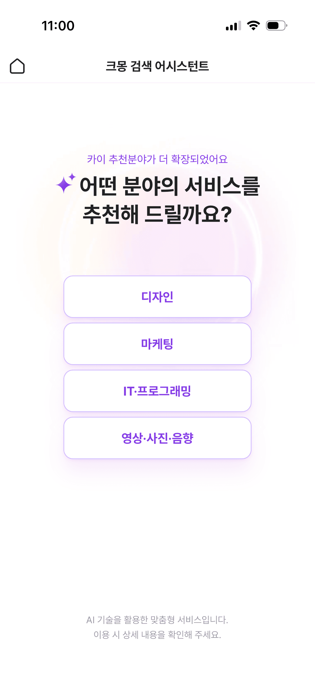
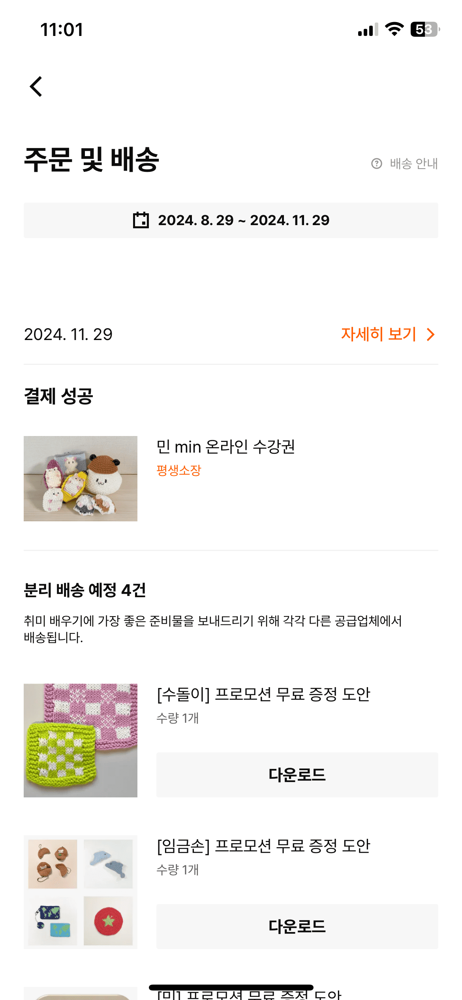
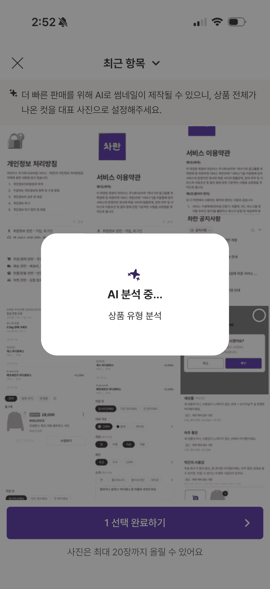
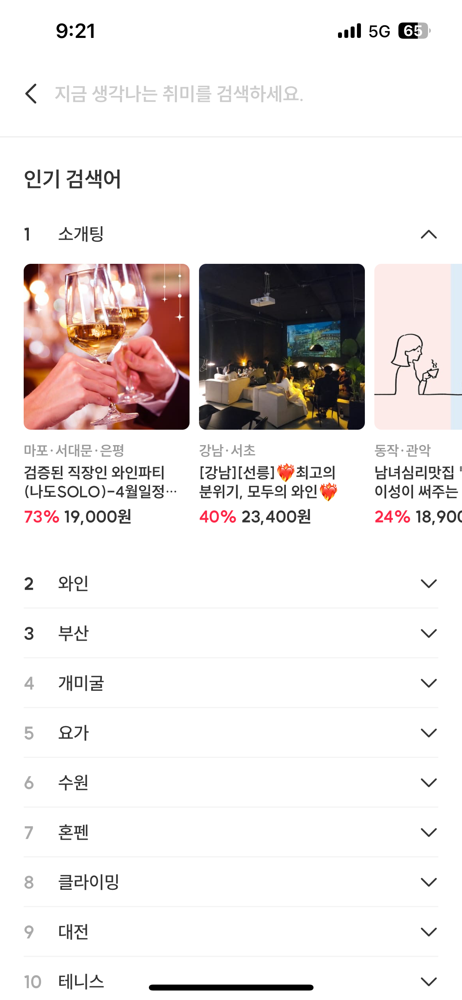
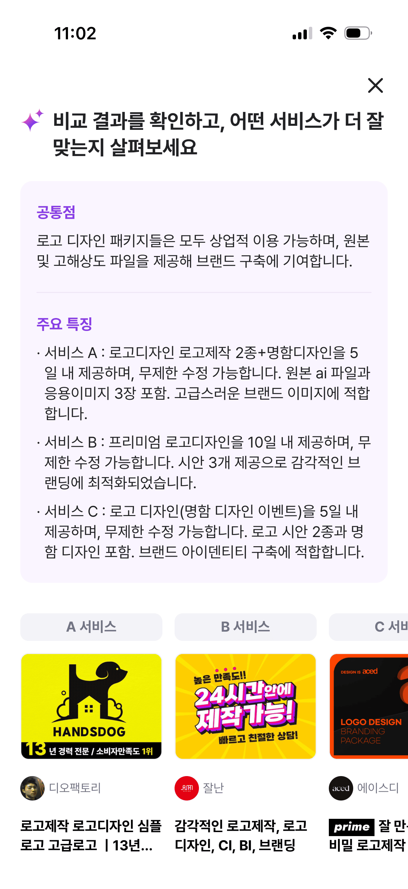
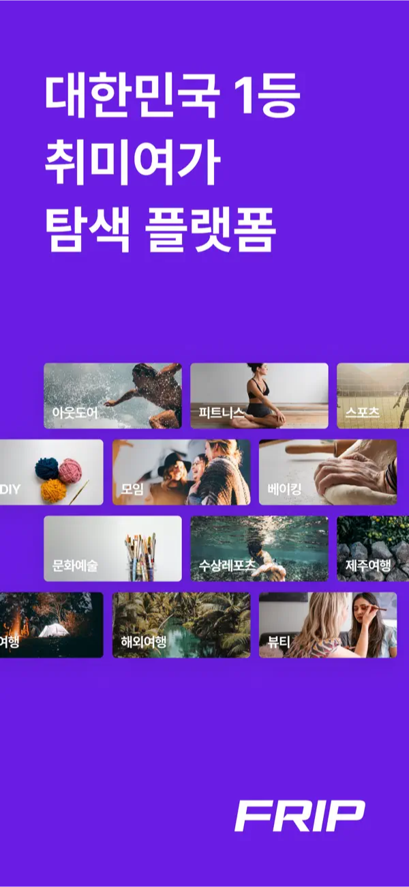
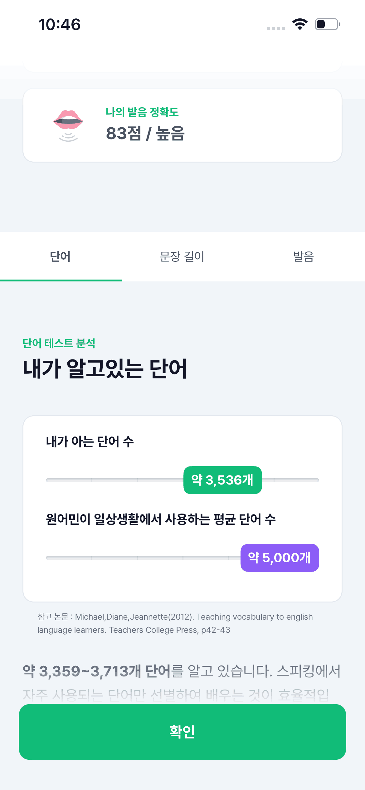
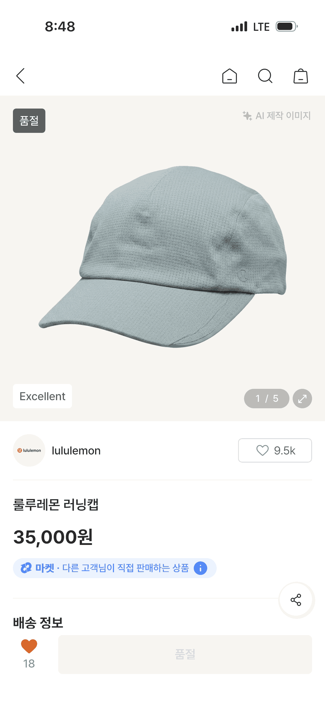
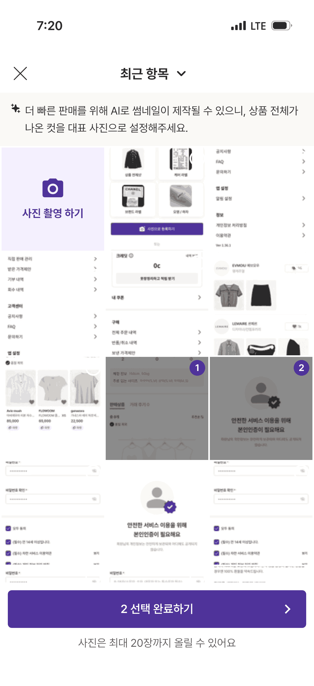

# Reference Analysis

**분석일:** 2026-09-18
**분석 대상:** 11장 스크린샷 (5개 앱: 크몽 / 클래스101 / 프립 / 차란 / 플랭·말해보카)
**대상 PRD:** ../../PRD.md ("허들링" — AI 실무 학습 플랫폼 + 멤버 자산 마켓)

모든 관찰은 `raw/001~011.png` 을 Read 도구로 직접 열어 확인한 내용만 기록했다. 안 보이는 요소는 "안 보임"으로 표기했고, 추측 라벨("모던하다" 등) 대신 색·형태·배치를 그대로 적었다.

---

## 종합 요약

- 반복되는 UX 패턴 4개
- 공통 시각 스타일 4개
- 재사용 컴포넌트 패턴 5개

핵심 통찰:

- 상태(뱃지·진행률·잠금)를 **이미지 코너 뱃지 + 얇은 바 + 분수 표기**로 명확히 드러내는 패턴이 커머스(차란)·교육(플랭/말해보카) 두 축에서 공통으로 나타난다 — PRD §9 "상태 표시가 명확"과 직접 맞닿는다.
- AI 관련 화면(크몽 001/002, 차란 009)은 하나같이 **보라색 강조 + 스파클 아이콘 + 화이트 카드 위 dimmed 모달**로 "AI가 처리 중/추천 중"임을 드러낸다 — 허들링의 AI 검수·추천 흐름에 그대로 쓸 수 있는 어휘다.
- 검색 진입 화면(클래스101 003, 프립 006)은 입력창보다 **번호 매긴 인기 키워드 리스트**가 우선이며, 리스트를 펼치면 이미지 카드 미리보기가 붙는다 — 허들링 픽/스킬 라이브러리 검색 진입에 바로 적용 가능.

---

## UX 패턴

### 1. AI 온보딩 선택형 추천 흐름

- **근거 앱:** 크몽 (001)
- **관찰:** 상단에 작은 보라색 라벨("카이 추천분야가 더 확장되었어요") + 스파클 아이콘이 붙은 큰 볼드 질문형 헤드라인 → 그 아래 세로로 쌓인 4개의 outline 버튼(디자인/마케팅/IT·프로그래밍/영상·사진·음향)을 탭해 AI 추천을 좁혀나간다. 버튼 사이 간격이 넉넉하고 한 화면에 선택지 외 다른 요소가 거의 없다.
- **우리 앱 적용:** 스킬 라이브러리의 "AI로 스킬 추천받기" 진입 화면(선택 시)에 이 세로 스택 선택형 흐름을 채택할 수 있음. 필수 5개 화면 안에서는 스킬 라이브러리 카테고리 필터 진입 애니메이션/1차 온보딩으로 축소 적용 가능.
- **참고 이미지:**
  

### 2. 상태별 섹션 구분 리스트

- **근거 앱:** 클래스101 (004)
- **관찰:** "주문 및 배송" 화면이 날짜 범위 pill → "결제 성공" 볼드 섹션 헤더 + 아이템 로우(썸네일+제목+주황색 태그) → 구분선 → "분리 배송 예정 4건" 볼드 섹션 헤더 + 설명문 + 아이템 로우 반복(각 로우마다 우측/하단에 개별 액션 버튼 "다운로드") 순으로 쌓인다. 상태가 다른 항목을 같은 리스트 UI로 섹션만 나눠 보여준다.
- **우리 앱 적용:** "내 자산" 화면의 상태 필터(비공개/멤버공개/판매신청중/판매중)를 이 섹션 구분 방식으로, "미션 상세"의 제출 상태(작성중/제출완료/피드백대기/승인)와 이전 피드백 기록 나열에도 동일 구조 적용.
- **참고 이미지:**
  

### 3. AI 처리 로딩 모달

- **근거 앱:** 차란 (009)
- **관찰:** 배경 화면이 회색으로 dimmed 처리되고, 중앙에 흰색 라운드 카드가 떠서 스파클 아이콘 + 볼드 텍스트 "AI 분석 중..." + 회색 서브텍스트 "상품 유형 분석"을 보여준다. 배경 위 요소(사진, 목록)는 흐리지 않고 톤만 죽인 상태로 유지된다.
- **우리 앱 적용:** 미션 제출 후 AI/운영자 검수 대기, 내 자산 등록 시 AI 자동 태깅·검수 진행 중 상태에 동일한 dimmed 배경 + 중앙 화이트 카드 + 상태 문구 모달 채택.
- **참고 이미지:**
  

### 4. 랭크드 인기 검색어 + 확장 미리보기

- **근거 앱:** 클래스101 (003), 프립 (006)
- **관찰:** 클래스101은 검색창 아래 "지금 인기있는 최근 30분" + 번호(1~10, 주황 숫자) 매긴 단순 텍스트 리스트. 프립은 같은 번호 리스트에 각 행마다 펼침/접힘 chevron이 있고, 1위 항목을 펼치면 가로 스크롤 카드(이미지+지역태그+제목+할인율 빨간 숫자+가격 볼드)가 나타난다.
- **우리 앱 적용:** 스킬 라이브러리·허들링 픽 검색바 탭 시 진입하는 화면에 번호 매긴 인기 검색어 리스트를 기본으로 두고, 필요 시 프립처럼 항목 펼치면 카드 미리보기가 붙는 구조로 확장.
- **참고 이미지:**
  
  

---

## 시각 패턴

### 1. 보라색 AI 강조 + 그라디언트 블러 배경

- **근거 앱:** 크몽 (001, 002)
- **관찰:** AI 관련 화면 두 장 모두 보라색(라벨 텍스트, 버튼 텍스트/테두리, "공통점" 헤더)을 강조색으로 쓰고, 001은 헤드라인 뒤로 은은한 보라~핑크 그라디언트 블러 원형이 배경에 깔려 있다. 본문 텍스트는 검정, 배경은 흰색.
- **우리 앱 적용:** 브랜드 컬러 자체는 Phase 3에서 확정하지만, "AI가 관여하는 화면(추천/검수/로딩)"에는 별도의 강조색+아이콘(스파클류)을 일관되게 쓰는 패턴을 규칙화할 수 있음.
- **참고 이미지:**
  
  

### 2. 이미지 타일 그리드 + 텍스트 오버레이

- **근거 앱:** 프립 (005)
- **관찰:** 사진 타일이 여백 없이 촘촘히(엣지투엣지에 가깝게) 3열 그리드로 배치되고, 각 타일 좌하단에 흰색 볼드 텍스트 라벨(아웃도어/피트니스/스포츠 등)이 이미지 위에 바로 얹혀 있다. 별도 카드 배경이나 그림자는 안 보임.
- **우리 앱 적용:** 이 화면 자체는 마케팅 랜딩(보라 풀블리드 배경)이라 레이아웃 전체보다 "이미지+오버레이 텍스트 라벨" 타일 스타일만 스킬 라이브러리 카테고리 진입 그리드 또는 허들링 픽 카테고리 필터 칩에 부분 채택.
- **참고 이미지:**
  

### 3. 옅은 회색 배경 위 화이트 라운드 카드 대비

- **근거 앱:** 플랭 (010), 말해보카 (011)
- **관찰:** 두 앱 모두 화면 배경은 옅은 회색(정확한 헥스는 확인 불가)이고, 그 위에 radius가 큰 흰색 카드가 콘텐츠 단위로 떠 있다. 그림자는 거의 안 보이거나 매우 옅음. 카드 내부에 여백이 넉넉해 밀도가 높아 보이지 않는다.
- **우리 앱 적용:** 홈의 미션 카드, 최근 스킬 카드, 내 자산 요약 카드에 이 배경-카드 대비 방식을 적용해 "정보 밀도는 있지만 압도적이지 않음"(PRD §9)을 시각적으로 구현.
- **참고 이미지:**
  
  

### 4. 마스코트/일러스트 히어로 영역

- **근거 앱:** 말해보카 (011)
- **관찰:** 화면 상단 전체 폭을 차지하는 하늘색 그라디언트 배경 위에 캐릭터 일러스트(모자 쓴 새 캐릭터, 별 이펙트), 말풍선("You can do it!"), 배경 산+깃발 일러스트가 함께 배치된 히어로 영역.
- **우리 앱 적용:** 캐릭터 자체는 PRD 톤("실험실+자산 라이브러리", 신뢰감+젊음)과 결이 다르므로 채택하지 않되, "화면 상단 전체 폭 그라디언트 히어로 영역 + 짧은 동기부여 문구"라는 틀만 홈 화면 상단(이번 달 미션 카드 배경)에 절제된 형태로 참고 가능.
- **참고 이미지:**
  

---

## 컴포넌트 패턴

### 1. 이미지 코너 상태뱃지 + 컨디션 태그 pill

- **근거 앱:** 차란 (008)
- **관찰:** 상품 이미지 좌상단에 어두운 회색 배경의 "품절" 뱃지, 우상단에 "AI 제작 이미지" 회색 텍스트+아이콘 라벨, 이미지 하단에는 "1/5" 페이지 인디케이터. 이미지 아래에는 별도 outline pill "Excellent"(컨디션 태그), 더 아래엔 파란 배경 pill "마켓 · 다른 고객님이 직접 판매하는 상품"(거래 유형 뱃지)이 있다.
- **우리 앱 적용:** 내 자산 카드의 상태뱃지(비공개/판매신청중/판매중/검수중), 허들링 픽 카드의 무료·유료 표시, 스킬 라이브러리 카드의 난이도/무료·유료 표시에 "이미지 코너 뱃지 + 하단 pill 태그" 조합을 재사용.
- **참고 이미지:**
  

### 2. 진행률 바 2종 (단순 채움형 / 비교 트랙형)

- **근거 앱:** 말해보카 (011), 플랭 (010)
- **관찰:** 말해보카는 카드 안에 얇은 바(오렌지/노랑 채움)와 "1/3" 분수 텍스트가 나란히 붙는 단순 진행률. 플랭은 회색 트랙 위에 값 위치에 맞춰 컬러 pill("약 3,536개" 초록, "약 5,000개" 보라)이 얹히는 비교형 바로, 두 값을 같은 트랙에서 비교해서 보여준다.
- **우리 앱 적용:** 홈의 미션 진행률(D-day)에는 단순 채움형+분수 표기(말해보카 방식), 내 자산의 "이번 달 목표 대비 판매 수익" 같은 비교가 필요한 경우 플랭의 비교 트랙형을 적용.
- **참고 이미지:**
  
  

### 3. 언더라인 탭 네비게이션

- **근거 앱:** 클래스101 (003, 하단 6아이콘 탭바), 플랭 (010, 상단 3탭), 말해보카 (011, 상단 2탭)
- **관찰:** 세 화면 모두 활성 탭은 검정/컬러 텍스트 + 하단 굵은 언더라인(플랭은 초록, 말해보카는 보라)으로 표시하고, 비활성 탭은 회색 텍스트로 처리한다. 클래스101 하단 탭바는 아이콘+라벨 조합, 나머지 둘은 텍스트만.
- **우리 앱 적용:** 스킬 라이브러리의 카테고리/난이도 필터 탭, 내 자산의 상태 필터 탭에 동일한 언더라인 활성 표시 방식 채택.
- **참고 이미지:**
  
  

### 4. Sticky 하단 풀폭 CTA 버튼

- **근거 앱:** 차란 (007, 009 — "N 선택 완료하기" 보라 버튼), 플랭 (010 — "확인" 초록 버튼)
- **관찰:** 두 앱 모두 화면 하단에 화면 폭 전체를 채우는 단일 버튼이 고정되어 있고, 버튼 위 캡션 텍스트("사진은 최대 20장까지 올릴 수 있어요")가 함께 붙는 경우가 있다. 버튼 텍스트는 굵고, 우측에 화살표 아이콘이 붙기도 한다(차란).
- **우리 앱 적용:** 미션 상세의 "제출하기", 내 자산의 "새 자산 등록", 허들링 픽 상세의 "구매하기"에 동일한 sticky 풀폭 CTA 패턴 적용.
- **참고 이미지:**
  
  

### 5. 카드형 아이템 로우 (썸네일 + 텍스트 + 액션 버튼)

- **근거 앱:** 클래스101 (004)
- **관찰:** 정사각형에 가까운 썸네일(좌) + 제목/서브텍스트(우) 로우가 반복되고, 필요한 항목에는 로우 아래 전체 폭 회색 버튼("다운로드")이 붙는다. 로우 사이는 여백으로만 구분되고 카드 테두리/그림자는 안 보임.
- **우리 앱 적용:** 홈의 "최근 학습한 자료"/"최근 스킬 카드" 리스트, 미션 상세의 "관련 스킬 카드 추천" 리스트에 이 로우 구조 적용.
- **참고 이미지:**
  

---

## 앱별 상세 (부록)

### 크몽 (Kmong)

**수집 화면:** 2장

#### 001-kmong-ai-search.png

- 화면 유형: AI 검색 어시스턴트 온보딩/추천 진입
- UX 특징: 홈 아이콘(좌) + 타이틀(중앙) 헤더 → 보라 라벨 + 스파클 헤드라인 → 4개 세로 스택 선택 버튼 → 하단 고지문. 다른 조작 요소 없음.
- 시각 스타일: 흰 배경, 헤드라인 뒤 보라~핑크 그라디언트 블러 원, 버튼은 흰 배경+보라 테두리+보라 볼드 텍스트, 여백 매우 넉넉.
- 주요 컴포넌트: outline 선택 버튼(풀폭), 스파클 아이콘, 소형 안내 텍스트.
- 우리 앱 적용: 스킬 라이브러리 AI 추천 진입/온보딩 선택 흐름.

#### 002-kmong-compare.png

- 화면 유형: AI 비교 결과 모달(바텀시트형, 상단 X 닫기)
- UX 특징: 볼드 헤드라인 → 연보라 카드(공통점/구분선/주요특징 불릿) → 가로 스크롤 탭 pill(A/B/C 서비스) → 그 아래 썸네일+판매자+제목 카드 나열.
- 시각 스타일: 연보라 배경 카드로 AI 요약 영역을 구분, 보라 볼드 소제목("공통점", "주요특징"), 본문은 검정/회색.
- 주요 컴포넌트: AI 요약 카드, 가로 스크롤 탭, 비교 카드.
- 우리 앱 적용: 직접적인 "서비스 A/B/C 비교" 기능은 허들링에 불필요. 다만 "AI 요약 카드"(공통점/특징 정리) 어휘는 미션 피드백 요약 등에 참고 가능.

### 클래스101 (Class101)

**수집 화면:** 2장

#### 003-class101-search.png

- 화면 유형: 검색 진입 화면
- UX 특징: 회색 라운드 검색 입력창(플레이스홀더+검색아이콘) → "지금 인기있는 최근 30분" 라벨 → 번호(주황) 매긴 텍스트 리스트 10개 → 하단 탭바(홈/개별구매/클럽/커뮤니티/검색/내클래스, 현재 탭 강조).
- 시각 스타일: 흰 배경, 주황 포인트(순위 숫자), 리스트 항목 간 여백 크고 카드 없음.
- 주요 컴포넌트: 검색 입력창, 번호 리스트, 하단 탭바.
- 우리 앱 적용: 스킬 라이브러리/허들링 픽 검색 진입 화면의 인기 검색어 리스트 + 하단 탭바 활성 표시.

#### 004-class101-order.png

- 화면 유형: 주문 및 배송(상태별 내역) 화면
- UX 특징: 뒤로가기+타이틀+안내 링크 헤더 → 날짜범위 pill → 날짜+"자세히보기" 링크 → "결제 성공" 섹션(아이템 로우) → "분리 배송 예정 4건" 섹션(설명문+아이템 로우 반복, 각 로우에 "다운로드" 버튼).
- 시각 스타일: 흰 배경, 볼드 섹션 헤더로 위계 구분, 태그 텍스트는 주황(평생소장), 버튼은 옅은 회색 배경.
- 주요 컴포넌트: 날짜 범위 pill, 섹션 헤더, 아이템 로우, 풀폭 보조 버튼.
- 우리 앱 적용: 내 자산 상태별 섹션 리스트, 미션 상세 제출/피드백 이력 섹션.

### 프립 (Frip)

**수집 화면:** 2장

#### 005-frip-category.png

- 화면 유형: 마케팅 랜딩(앱 소개/스플래시성 화면 — 실사용 내부 화면 아님)
- UX 특징: 화면 대부분이 카피 문구 + 카테고리 이미지 그리드로 구성, 인터랙션 요소(버튼 등)는 안 보임.
- 시각 스타일: 배경 전체 보라 단색, 흰색 볼드 대형 헤드라인, 이미지 타일 위 흰 텍스트 오버레이, 타일 간 여백 거의 없음, 하단 흰색 로고.
- 주요 컴포넌트: 이미지+텍스트 오버레이 타일 그리드.
- 우리 앱 적용: 레이아웃 전체보다 "이미지 위 텍스트 오버레이 타일" 스타일만 카테고리 필터 칩에 부분 차용. 마케팅 랜딩 성격이라 화면 구조 자체는 우리 5개 화면과 매칭 낮음("우리에겐 불필요"에 가까움).

#### 006-frip-search.png

- 화면 유형: 검색 진입 화면
- UX 특징: 텍스트형 검색 placeholder(입력창 테두리 안 보임) → "인기 검색어" 볼드 헤더 → 번호+chevron 리스트, 1위 펼침 상태로 가로 스크롤 카드(이미지+지역태그+제목+할인율(빨강)+가격(검정 볼드)) 노출.
- 시각 스타일: 흰 배경, 강조색은 빨강(할인율), 카드 라운드 큼.
- 주요 컴포넌트: 확장형 순위 리스트, 가로 스크롤 미리보기 카드.
- 우리 앱 적용: 허들링 픽 검색 화면의 인기 검색어+카드 미리보기.

### 차란 (Charan)

**수집 화면:** 3장

#### 007-charan-asset-register.png

- 화면 유형: 여러 화면이 겹쳐 보이는 콜라주(자산 등록/사진 첨부 관련 다수 화면이 한 캡처에 중첩된 것으로 보임 — 단일 화면 레이아웃으로 보기 어려움)
- UX 특징: 안내 배너("더 빠른 판매를 위해 AI로 썸네일이 제작될 수 있으니...") + 카메라 촬영 진입 타일("사진 촬영 하기") + 다수의 하위 화면(구매내역/쿠폰/본인인증/설정메뉴/상품카드 그리드)이 겹쳐 보임 + 하단 sticky 보라 버튼("2 선택 완료하기") + 캡션("사진은 최대 20장까지 올릴 수 있어요").
- 시각 스타일: 보라 포인트 컬러, 카메라 타일은 연보라 배경, 하단 버튼 진보라.
- 주요 컴포넌트: 안내 배너, 카메라 촬영 CTA 타일, sticky 풀폭 버튼.
- 우리 앱 적용: 개별 화면 레이아웃 전체보다 "안내 배너 + 촬영/업로드 CTA 타일 + sticky 완료 버튼" 요소만 내 자산 등록 흐름에 채택. 콜라주로 겹친 하위 화면들(쿠폰/설정 메뉴 등)은 허들링과 무관해 "우리에겐 불필요".

#### 008-charan-pdp-sold.png

- 화면 유형: 상품 상세(PDP), 판매완료(품절) 상태
- UX 특징: 상단 아이콘 네비(뒤로/홈/검색/장바구니) → 이미지(좌상단 "품절" 뱃지, 우상단 "AI 제작 이미지" 라벨, 하단 페이지 인디케이터) → 컨디션 태그("Excellent") → 판매자 행(아바타+이름+좋아요 pill) → 제목/가격 → 거래유형 pill("마켓 · 다른 고객님이 직접 판매") → 공유 아이콘 → 배송정보 섹션(좋아요 카운트+회색 "품절" 오버레이).
- 시각 스타일: 흰 배경, 뱃지는 어두운 회색/파랑, 가격은 검정 볼드 대형.
- 주요 컴포넌트: 이미지 코너 상태뱃지, 컨디션 pill, 판매자 row, 거래유형 pill.
- 우리 앱 적용: 내 자산 카드·허들링 픽 카드의 상태뱃지·판매자(제작자) row·가격 표기에 직접 참고.

#### 009-charan-ai-loading.png

- 화면 유형: AI 분석 로딩 모달 (007과 동일한 배경 화면 위에 모달만 추가된 상태)
- UX 특징: 배경 dimmed + 중앙 흰 라운드 카드에 스파클 아이콘 + "AI 분석 중..." 볼드 + "상품 유형 분석" 회색 서브텍스트.
- 시각 스타일: 모달 카드 radius 큼, 그림자 옅게 있음, 배경은 톤다운된 회색.
- 주요 컴포넌트: dimmed 오버레이, 중앙 로딩 모달.
- 우리 앱 적용: 미션 제출 AI 검수 대기, 자산 등록 AI 자동 분석 로딩에 그대로 적용.

### 플랭 (Plang)

**수집 화면:** 1장

#### 010-plang-progress.png

- 화면 유형: 학습 통계/리포트 화면
- UX 특징: 상단 요약 카드(아이콘+라벨+대형 점수) → 3탭(단어/문장길이/발음, 언더라인 활성) → 회색 배경 위 콘텐츠(초록 라벨+볼드 제목) → 흰 카드 안 비교형 진행률 바 2행(내 단어 수 vs 원어민 평균) → 출처 인용 텍스트 → sticky 하단 초록 "확인" 버튼.
- 시각 스타일: 배경 옅은 회색, 카드 흰색 radius 큼, 강조색 초록(활성탭 언더라인, CTA 버튼, 값 pill)과 보라(비교값 pill) 병용.
- 주요 컴포넌트: 요약 점수 카드, 언더라인 탭, 비교형 진행률 바, sticky CTA.
- 우리 앱 적용: 홈의 미션 진행률 요약, 내 자산의 목표 대비 실적 비교 바.

### 말해보카 (Malhaeboca)

**수집 화면:** 1장

#### 011-malhaeboca-challenge.png

- 화면 유형: 게이미피케이션 도전 과제 목록
- UX 특징: 헤더(뒤로+타이틀, 우측 재화 카운트) → 하늘색 그라디언트 히어로(캐릭터 일러스트+말풍선+산 일러스트) → 2탭(언더라인 활성) → 설명문 → 도전과제 카드(Lv뱃지+제목, 잠금 아이콘, 보상 재화+진행률바+분수, "?" 정보 아이콘).
- 시각 스타일: 밝고 채도 높은 하늘색/보라, 카드 radius 큼, 잠금 아이콘은 그레이스케일로 미해금 상태 표현.
- 주요 컴포넌트: 재화 카운트 배지, 히어로 일러스트, 레벨 뱃지, 잠금 아이콘, 얇은 진행률바+분수 표기.
- 우리 앱 적용: 홈/미션 상세의 레벨·잠금·재화·진행률 표기 어휘 채택. 캐릭터 일러스트 톤은 채택하지 않음(브랜드 톤 불일치).

---

## 우리 앱 적용 계획

### 화면별 적용

- **홈:** 시각-3(회색 배경 위 화이트 카드) + 컴포넌트-2(단순 채움형 진행률바, 말해보카 방식)로 "이번 달 미션 카드(진행률·D-day)" 구성. 컴포넌트-5(카드형 아이템 로우)로 "최근 학습한 자료"·"최근 스킬 카드" 리스트. 컴포넌트-1(상태뱃지)로 "내 자산 진행 상황 요약" 카드에 상태 표시.
- **스킬 라이브러리:** UX-4(랭크드 인기검색어)로 검색바 탭 시 진입 화면. 컴포넌트-3(언더라인 탭)으로 카테고리/난이도 필터. 컴포넌트-1(상태뱃지)로 각 카드의 무료/유료·난이도 표시. 시각-2(이미지+오버레이 라벨)를 카테고리 그리드 칩에 부분 적용.
- **미션 상세:** UX-2(상태별 섹션 리스트)로 제출 상태 및 이전 피드백 이력. UX-3(AI 로딩 모달)로 검수 대기 상태. 컴포넌트-2(진행률바)로 마감일/진행 표기. 컴포넌트-4(sticky CTA)로 "제출하기" 버튼. 컴포넌트-5(아이템 로우)로 "관련 스킬 카드 추천" 리스트.
- **내 자산:** UX-2(상태별 섹션 리스트)로 전체/비공개/멤버공개/판매신청중/판매중 필터 결과. 컴포넌트-3(언더라인 탭)으로 상태 필터 탭. 컴포넌트-1(상태뱃지)로 각 자산 카드의 검수 진행 상황 표시. 컴포넌트-4(sticky CTA)로 "새 자산 등록" 버튼, 등록 흐름 내 UX-3(AI 로딩 모달)로 자동 태깅/검수 진행 표시(차란 007/009 참고).
- **허들링 픽:** UX-4(랭크드 인기검색어) 검색 진입. 컴포넌트-3(언더라인 탭)으로 카테고리/정렬. 컴포넌트-1(상태뱃지, 컨디션pill, 판매자row)로 픽 카드/상세 페이지(차란 008 PDP 패턴 그대로) — 제작자·가격·카테고리 표기. 컴포넌트-4(sticky CTA)로 상세 페이지 "구매하기" 버튼.

### 피해야 할 것

- 크몽 002의 3단 서비스 비교 테이블 전체 구조(허들링에 비교 대상 자체가 없음)
- 프립 005 마케팅 랜딩의 보라 풀블리드 스플래시 레이아웃(내부 화면 아님)
- 말해보카 011의 만화 캐릭터/유아틱 마스코트 톤(PRD "신뢰감+젊음", "실험실" 톤과 불일치) — 어휘(진행률·잠금·재화)는 채택하되 비주얼 톤은 배제
- 차란 007 콜라주 안의 쿠폰/설정 메뉴 등 허들링과 무관한 하위 화면들

### 필요 컴포넌트

- Button (primary/outline, sticky bottom 풀폭 variant 포함)
- Card (이미지+제목+상태뱃지, 아이템 로우형 2종)
- Badge/Pill (상태뱃지 코너형, 컨디션/카테고리 pill형)
- ProgressBar (단순 채움형 + 분수, 비교 트랙형)
- SearchBar + 랭크드 검색어 리스트
- Tab (언더라인 활성 표시)
- Modal (dimmed 배경 + 중앙 로딩 카드)
- SectionHeader (상태별 리스트 구분용)

### 디자인 방향

- 색상: AI 관여 화면은 보라 계열 강조색 사용 경향 관찰됨(크몽, 차란 로딩 모달) — 브랜드 컬러 최종안은 **Phase 3에서 결정**.
- 타이포: 헤드라인 볼드 대형 + 색상 강조 소형 라벨 + 회색 본문의 3단 위계가 공통 관찰됨 — role 기반 텍스트 스타일은 **Phase 3에서 확정**.
- 밀도: 클래스101 004(주문내역)처럼 섹션 구분 + 로우 반복 구조를 쓰면 정보량이 많아도 정리된 인상 — "정보 밀도 높지만 압도적이지 않음"(PRD §9) 구현에 참고. 카드 radius는 관찰된 레퍼런스 대부분 크게 사용(플랭/말해보카) — 정확한 토큰 값은 **Phase 3에서 결정**.

---

## 다음 단계

이 분석 결과를 바탕으로:

1. 화면 구조 정의 → structure-builder 실행
2. 디자인 규칙 확정 → design-rules-generator 실행 (Phase 3)
3. Figma 화면 생성 → figma-builder 실행 (Phase 4)
